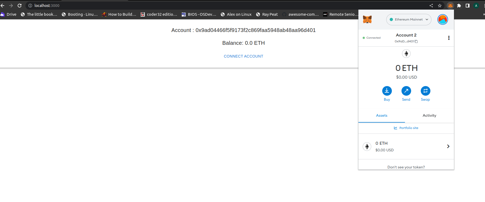

### React.j with Web3.0/Lesson-7/ 🧑🏼‍💻

**Setting up Metamask with React Application**

📌. Create React Application

```
npx create-react-app meta-react
```

📌. installing require libraries

```
npm install ethers @mui/material @emotion/react @emotion/styled
```

📌. In case if you got  error:0308010C:digital envelope routines::unsupported on starting the server then please update your react-scripts by following command

```
npm install react-scripts@latest
```

then re-start the server via : 

```
npm start
```

